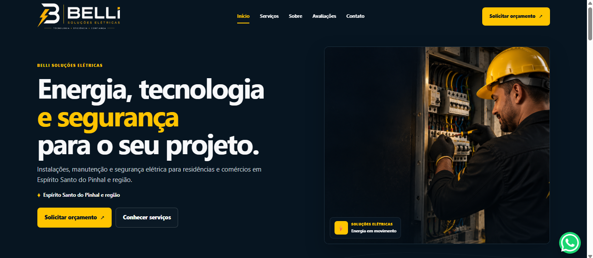

# Belli Soluções Elétricas

Landing page responsiva desenvolvida para a **Belli Soluções Elétricas**, com foco em apresentação de serviços, experiência mobile e contato direto com clientes através do WhatsApp.

## Sobre o projeto

A proposta desta landing page é apresentar a Belli de forma clara, moderna e profissional para pessoas que chegam até a empresa pela internet.

A página foi pensada para ajudar o visitante a entender rapidamente:

- quais serviços a empresa oferece;
- qual região é atendida;
- quais são os diferenciais da Belli;
- como funciona o atendimento;
- avaliações de clientes;
- como solicitar um orçamento.

O projeto foi desenvolvido com atenção especial à navegação pelo celular.

## Preview

> Projeto em desenvolvimento.



## Demonstração

🔗 [Acesse a landing page online](https://willowy-malasada-cd60a2.netlify.app/)

## Tecnologias utilizadas

- HTML5
- CSS3
- JavaScript
- Design responsivo
- Mobile First
- Intersection Observer
- Integração com WhatsApp
- Animações durante o scroll

## Funcionalidades

- Layout responsivo para celular, tablet e desktop
- Menu de navegação mobile
- Apresentação dos principais serviços
- Botões de contato via WhatsApp
- Seção sobre a empresa
- Etapas do atendimento
- Avaliações de clientes
- FAQ interativo
- Animações durante a navegação
- Botão flutuante de WhatsApp
- Links para redes sociais

## Estrutura do projeto

```text
belli-solucoes-eletricas/
├── assets/
├── index.html
├── style.css
├── script.js
└── README.md
